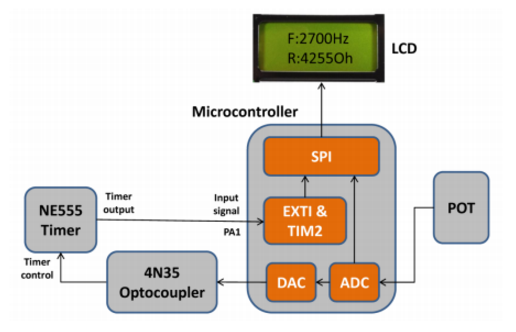

# PWM-Monitor
Microprocessor Based Systems Project - Pulse Width Modulated Signal Monitoring

# Summary
The purpose of this project was to develop an embedded system for monitoring and controlling a pulse-width-modulated (PWM) signal that was generated by an external timer (NE555 Timer). An external optocoupler (4N35 IC), driven by the microcontroller on the STMF0 Discovery board was used to control the frequency of the PWM signal. The microcontroller was used to measure the voltage across a potentiometer (POT) on the PBMCUSLK board and relay it to the external optocoupler for controlling the PWM signal frequency. The measured frequency and corresponding POT resistance were displayed on the LCD on the PBMCUSLK board. The overall system diagram is shown below.

# Images

